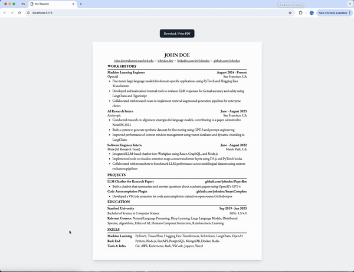

# html-resume-template
Made for those who don't like LaTeX or only want to edit a config without the hassle of starting from scratch.

## Demo


## Quick Start
1. Clone the template with ```git clone --depth=1 https://github.com/emilsharkov/html-resume-template <YOUR_PROJECT_NAME>```
2. Navigate to your new project with ```cd <YOUR_PROJECT_NAME>```
3. Install dependencies with ```npm install```
4. Start the dev server with ```npm run dev```
5. Edit ```template.ts``` config inside ```src/template``` with your info
6. Click the ```Print``` button on the page to save as ```.pdf``` file

 ## Technologies
- `React`
- `Tailwind`
- `react-to-print`
- `TypeScript`